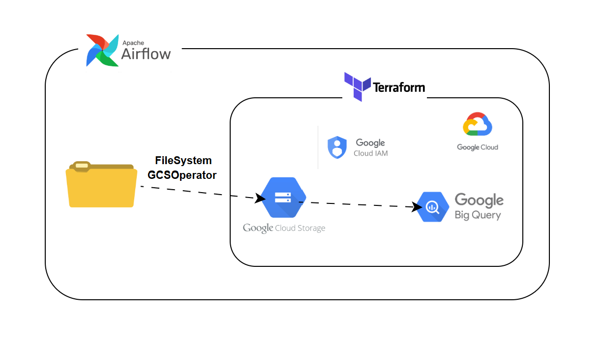
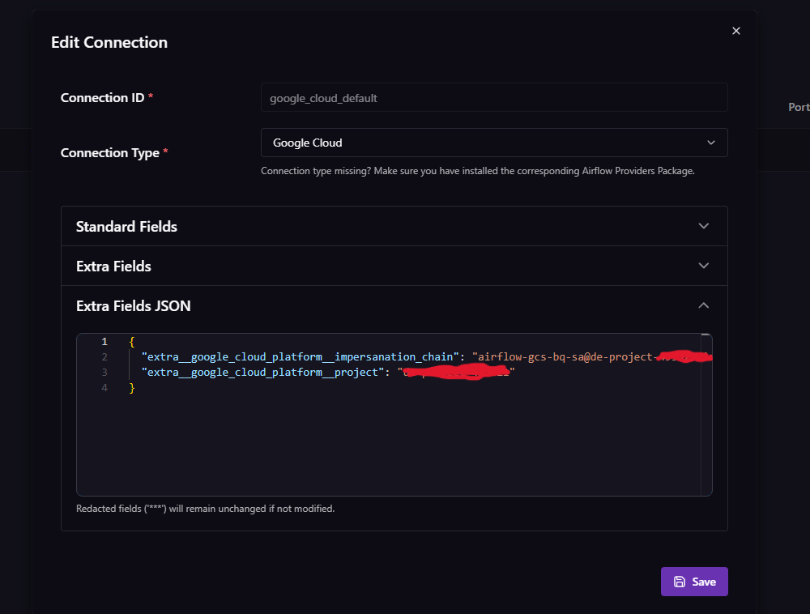
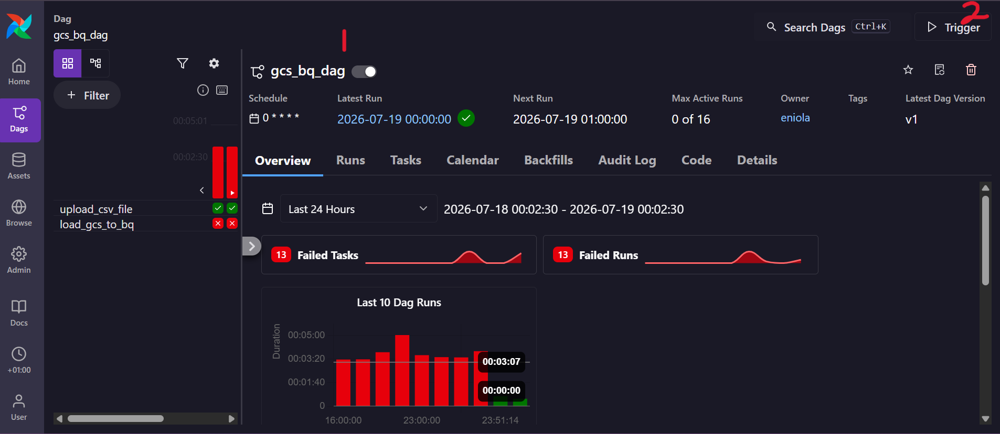
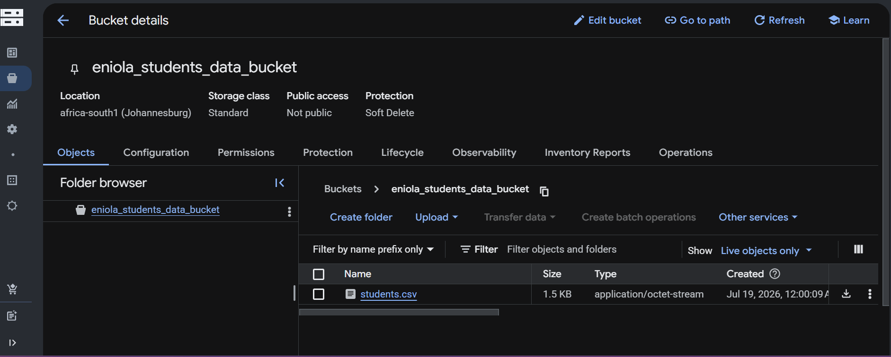
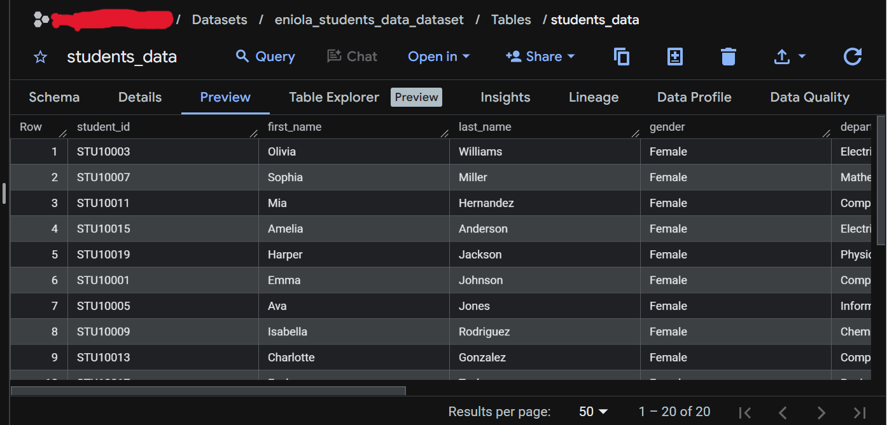
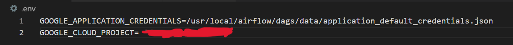

# Google Cloud Data Ingestion Pipeline with Airflow

## Project Overview

This project is an end-to-end data pipeline that uses Apache Airflow to automate the ingestion of CSV files from a local file system into Google Cloud Storage (GCS), and then loads the data into Google BigQuery. It demonstrates workflow orchestration, cloud storage integration, and automated data loading on Google Cloud Platform (GCP) using Apache Airflow.

## Problem Statement

Organizations often maintain important datasets on local systems, making it difficult to ensure timely, reliable, and consistent ingestion into cloud-based data warehouses. Manual data transfer processes are slow, error-prone, and difficult to scale as data volumes grow.

Without automation, analysts and engineers waste time managing infrastructure and moving data instead of focusing on insights.

This project addresses these challenges by providing a fully automated, reproducible, and secure workflow that transfers files from a local file system to Google Cloud Storage and then into BigQuery, while following best practices for infrastructure provisioning and access control.


## Project Architecture



Terraform provisions and manages the required GCP infrastructure, including IAM permissions, the Google Cloud Storage (GCS) bucket, and the BigQuery dataset. Once the infrastructure is in place, an Apache Airflow DAG orchestrates the data ingestion workflow by retrieving files from a local file system, uploading them to GCS, and loading the data into BigQuery.

## Objectives
The objectives of this project are to:

- Demonstrate Infrastructure as Code (IaC) using Terraform to provision cloud resources.
- Automate file ingestion into GCS and Bigquery
- Ensure consistent and reliable data ingestion using Airflow.
- Enable secure cloud resource management with Google Cloud IAM roles and permissions.
- Provide a scalable, repeatable architecture that can accommodate large and growing datasets.
- Simplify workflow execution and monitoring through Airflow scheduling and orchestration.

## Tech stack

| Tools | Description|
|------------------|-----------------|
|Terraform	| Automates cloud resource provisioning|
|Python	| For scripting Airflow DAG logic |
|Apache Airflow | Orchestrates and schedules the data pipeline|
|Google Cloud IAM | Manages access and security roles for GCS and BigQuery|
|Google Cloud Storage (GCS) | Serves as staging for BigQuery loading |
|Google BigQuery | Cloud data warehouse for structured data storage and analytics|

## Project Workflow 
This pipeline was developed in the following stages 

Infrastructure provisioning → Airflow initialization and configuration → Google cloud authentication → Triggering the Airflow DAG

### Infrastructure Provisioning
I provisioned the required Google Cloud resources using Terraform. The resources included:
- GCS Bucket
- BigQuery Dataset
- BigQuery Table

To create these resources

- Navigate to the Terraform directory `cd terraform`
- Initialize Terraform `terraform init`
- Configure the infrastructure in the .tf files
- Preview the execution plan `terraform plan`
- Provision the resources `terraform apply -auto-approve`

### Airflow initialization and configuration
After creating the cloud resources, I initialized Apache Airflow and configured the DAG.

- Return to project root `cd ..`
- Initialize Airflow `astro dev init`
- Configure the DAG to automate the ingestion workflow. The DAG consists of two tasks:
    - upload_csv_file_to_gcs - Uses `LocalFilesystemToGCSOperator` to upload CSV files from the local file system to Google Cloud Storage.
    - load_gcs_to_bq - Uses `GCSToBigQueryOperator` to load the uploaded files into BigQuery
- Then `astro dev start` to start the airflow UI/environment
- The UI is available at http://localhost:8080
- In the airflow UI, I configured it's connection to Google cloud 
    - To create a connection, Click on admin in the sidebar, then select connections and click on add connection
    - Set the connection ID field to `google_cloud_default`. That must be the name.
    - Select Google Cloud as the connection type, (because I am using both GCS and Bigquery)
    - In the Extra Fields JSON option, provide the service account credentials and the GCP project ID
    - Then save connection

    

### Google cloud authentication

- Authenticate Google Cloud SDK 

  `gcloud auth application-default login`
- Locate the path where login credentials were loaded

    ```
    Example
    C:\Users\HomePC\AppData\Roaming\gcloud\application_default_credentials.json
    ```
- Copy the values inside the application_default_credentials.json file
- Create a file named application_default_credentials.json inside the data folder
- Paste the copied values into the file
- Copy the directory path of the application credentials to a .env file

    `GOOGLE_APPLICATION_CREDENTIALS=/usr/local/airflow/dags/data/application_default_credentials.json`

### Trigger Airflow DAGS

- Back to the Airflow UI, Navigate to DAGs.
- Select the pipeline DAG.
- Activate and trigger the DAG

    
- Monitor the DAG run
- After the workflow completes successfully, verify that the CSV files were uploaded to the GCS bucket, and loaded into the BigQuery table.

    

    

## Challenges 

The pipeline initially was failing during the second task, which loads data from Google Cloud Storage into BigQuery. The issue occurred because the Airflow environment could not resolve the GCP project ID during execution.

To fix this, I added the project ID as an environment variable in the .env file. After restarting the Airflow environment, the DAG executed successfully and loaded the data into BigQuery.

